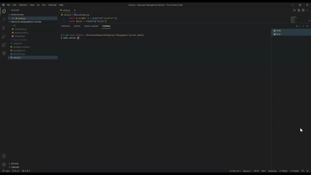

# Employee-Management-System

## What is this project about?

Build a command-line application that at a minimum allows the user to:

  * Add departments, roles, employees

  * View departments, roles, employees

  * Update employee roles

## How did I do it?

I created a database with employee, role, and department information in MySQL Workbench. I then got my server connected to the database and tied everything together with Node.js

## Installation

* Express
* Node
* MySQL
* Inquirer
* Util

## Contributors

Kelsea Hunt

## Video of Application

